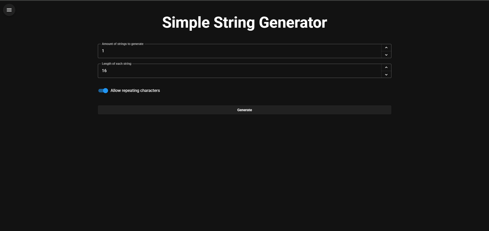
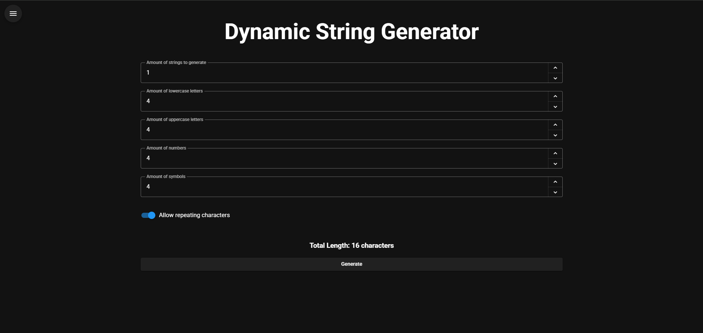
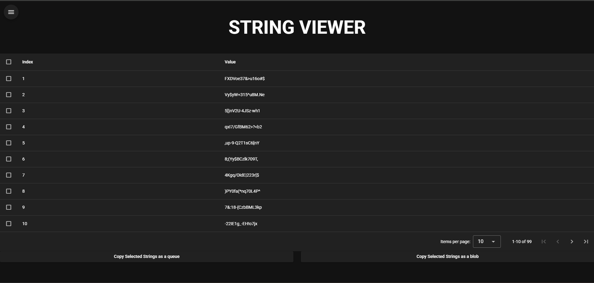
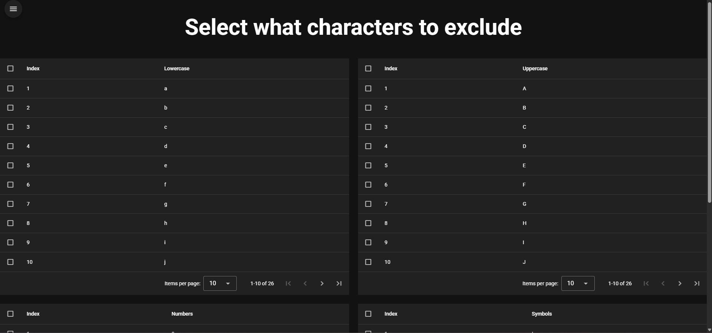

# 🔠 DYNAMIC STRING GENERATOR

A string generator that allows you to generate strings (characters) the cool way. You have 2 types of generators, simple generator for casual users who are only concerned with the length of their strings, and dynamic generator for power users allowing you to customize the length of lowercase, uppercase, numbers and special characters (symbols)

Link to live app: <https://dynamic-string-generator.pages.dev>

## STRING GENERATION

- For string generation, I used the native browser's `crypto.getRandomValues()` function for cryptographically secure strings, this means you can use this generator for casual and safe generation
- For shuffling the strings, I used the **Fisher Yates** Algorithm combined with `crypto.getRandomValues()`

## SIMPLE STRING GENERATOR



- You only customize the length of each string
- You can also customize whether each string can have repeating characters or not
- Maximum amount of strings you can generate at once is 99, minimum is 1
- Default amount of strings is 1
- Default length of strings is 16
- This generator is recommended for most people

## DYNAMIC STRING GENERATOR



- You can customize the following:
  1. The amount of lowercase characters (a - z)
  2. The amount of uppercase characters (A - Z)
  3. The amount of numbers (0 - 9)
  4. The amount of special characters/symbols/punctuation (!, @, #, $ etc)
- The max amount of symbols is 28: ! @ # $ % ^ & * ( ) _ - + = { [ } ] | : ; ? / > < . , ~
- You can also see the total amount of characters below ( lowercase + uppercase + numbers + symbols )
- You can also customize whether each string can have repeating characters or not
- Default amount of strings is 1
- Default length of strings is 16
- Maximum amount of strings you can generate at once is 99, minimum is 1
- This is recommended for people who like to control how many of each type of character gets generated

## STRING VIEWER



- Here you can view all the strings you just generated (resets after every generation)
- COPYING
  - Select all the strings you want to copy in the boxes adjacent to the index
  - COPY SELECTED STRINGS AS A QUEUE
    - This copied all the selected strings one by one like a queue
    - The strings are copied at a rate of 3.33 strings/sec
    - This ensures that all strings get copied into your clipboard individually, due to the asynchronous nature of `navigator.clipboard`
    - Due to this, its only recommended to use this option if you only copy a small amount of strings at a time, otherwise this option will be too slow
    - This option is good for copying a small amount of strings at once, and/or if you want to paste them individually
  - COPY SELECTED STRINGS AS A BLOB
    - This copied all the selected strings at once in 1 go
    - This is very good if you are copying a large amount of strings at once and cannot wait, since unlike the other option, it is synchronous and therefore has no delay
    - This is less convenient than the other option and is not recommended if you want to have each individual string to paste

## UNIQUENESS

- For both simple and dynamic generators you can specify whether you want the characters to repeat or not
- Usually this means you can specify as many type of characters to be generated in the dynamic generator
- But in this case, you can only specify as many characters that exist for that type of character (eg. 26 lowercase, 26 uppercase, 10 numbers and 28 symbols) because in this mode, characters aren't allowed to repeat
- This only applies to dynamic generator, but for simple generator you can only specify the length to be up to 90, as opposed to the normal length of 99

## CHARACTER SET



- This is the fun part, you are allowed to toggle which character you want to exclude during generation
- That means that in any string generated, you won't see any characters you toggled within any of the strings
- But be careful, if you exclude all characters of 1 type, you wont be able to specify the amount of that character in the dynamic string generator, since it will be at 0
- If you specify to generate unique strings (no repeating characters) then you will only be able to specify the amount of a certain character depending on how many you excluded (eg. if you excluded 6 numbers, you will only be able to specify up to 4 numbers to be generated)
- This is for the dynamic generator, but for the simple generator, you will only be able to specify the length of the string depending on the amount of characters that weren't excluded (eg. if you excluded 3 numbers, 8 symbols and 2 lowercase characters, you can only specify the string length up to 77 characters)
- The total amount of characters in the character set is 90

## What this app is great for

- Password Generators
- Token Generators
- Key Generators
- Any generator for random characters
- Just to have fun with!

## 🧱 Stack

- Framework: Vue 3 + Vite
- UI Library: Vuetify
- Language: TypeScript
- Package manager: npm

## ✨ Enabled Features

- ESLint
- Pinia
- File Router

## 💿 Install

Use your selected package manager (npm) to install dependencies:

```bash
npm install
```

## 🚀 Quick Start

```bash
npm install
npm run dev
```

## 🏗️ Build

```bash
npm run build
```
